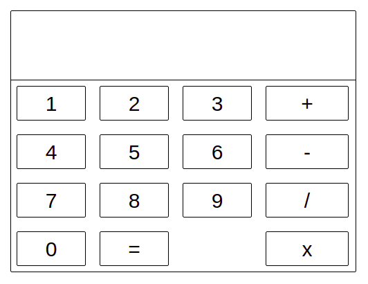

# Simple Calculator
Simple calculator which handles simple operations: addition, subtraction, division and multiplication



## Project setup
```
npm install
```

### Compiles and hot-reloads for development
```
npm run serve
```

### Compiles and minifies for production
```
npm run build
```

### Lints and fixes files
```
npm run lint
```

### Customize configuration
See [Configuration Reference](https://cli.vuejs.org/config/).


## Supported node version
```
14.19.3
```

## Controllers
mouse, keyboard

## Used technologies
Vue, CSS (SCSS)

## Author
Lukasz Sitnik
